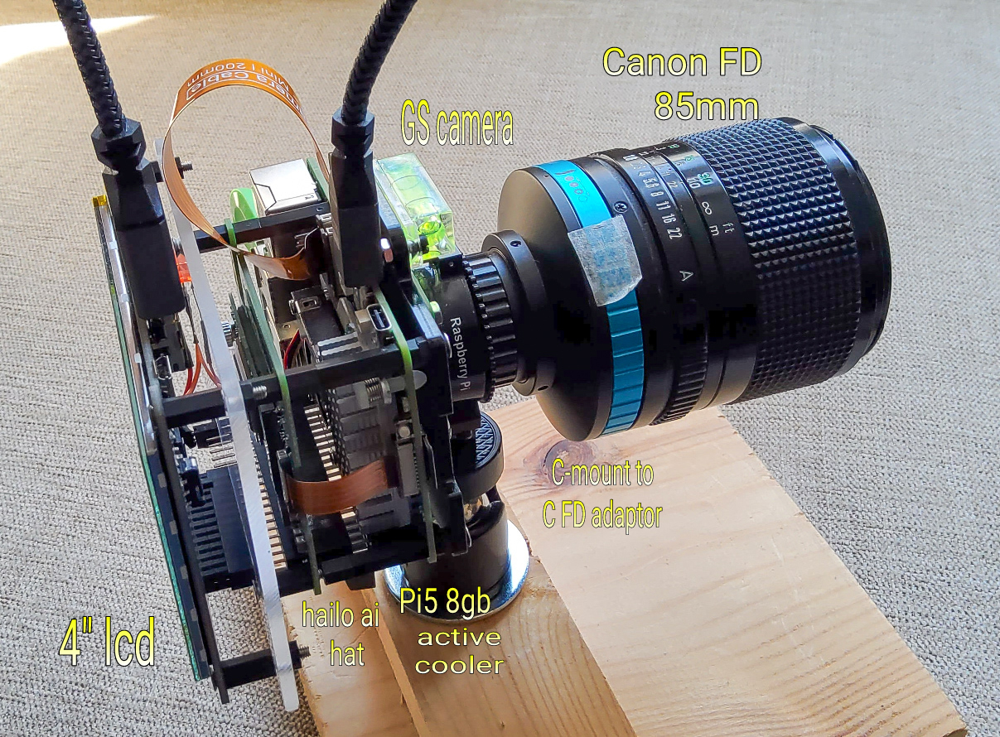

 # Pi_Hailo_wildlife_2

Pi5 + Hailo HAT + PI Camera to capture Wildlife videos

## My Camera setup...

It is a modified version of the hailo picamera2 detect.py example 

To setup the hailo..

     sudo apt install hailo-all

reboot

     git clone --depth 1 https://github.com/raspberrypi/picamera2

reboot

Captures videos and makes .mp4 videos

Change line 132 to suit your required detections .... 

    if len(results[0][15]) != 0 or len(results[0][21]) != 0 or len(results[0][74]) != 0: # cat,bear or clock

Note in line 89 the width and height are set for a Pi GS camera, you may need to change to suit other cameras ....

    video_w, video_h    = 1456,1088

Runs a pre-capture buffer of approx 5 seconds, set in line 20, pre_frames = 5

Copy detect_002.py into /home/USERNAME/picamera2/examples/hailo/

Videos saved in /home/USERNAME/Videos

to run ... 

cd /home/USERNAME/picamera2/examples/hailo/

python3 detect_002.py
