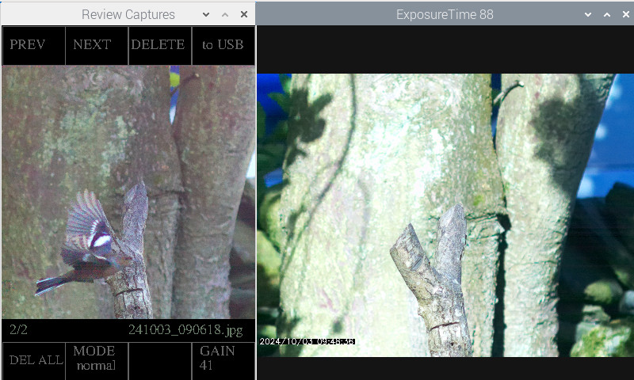

5# Pi_Hailo_wildlife_2

Pi5 + Hailo HAT + PI Camera to capture Wildlife videos

## Screenshot...

## My Camera setup...

It is a modified version of the hailo picamera2 detect.py example https://github.com/raspberrypi/picamera2/tree/main/examples/hailo

To setup the hailo..

     sudo apt install hailo-all

reboot

     git clone --depth 1 https://github.com/raspberrypi/picamera2

reboot

Captures videos and makes .mp4 videos

v_width and v_height are set for a Pi GS camera, you may need to change to suit other cameras ....

Runs a pre-capture buffer of approx 5 seconds, set in line 27, pre_frames = 5

you can set the objects to detect in line 21, objects = ["cat","bear","bird"], the objects must be in coco.txt file

Copy detect_002.py into /home/USERNAME/picamera2/examples/hailo/

Videos saved in /home/USERNAME/Videos

to run ... 

cd /home/USERNAME/picamera2/examples/hailo/

python3 detect_002.py

When running you will see 2 windows, a live window and a capture review and control window.
On the Capture review window you can see the triggered frame from  the videos, step through them with PREV/NEXT,
DELETE individual ones with DEL ( needs right mouse click), copy video and frame to USB with to USB.

at the bottom you have DELETE ALL ( right mouse click), and camera controls for MODE, SHUTTER SPEED and GAIN.
